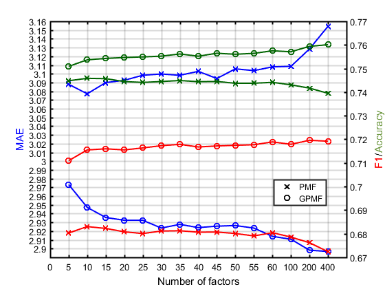

# GPMF
This is the GPMF implementation code. I use Matlab to estimate the parameters and Java to solve the optimazation.
Link to GPMF paper: https://ieeexplore.ieee.org/abstract/document/8588818
## Parameter estimation:
Run estimateParameters.m to get parameters needed for GPMF.
You can also use the parameters to fit rating data distribution using GLG-N.

## GPMF algorithm
Build project in 'GPMF_algorithm' folder and run GL.java to run optimization.
## Results

